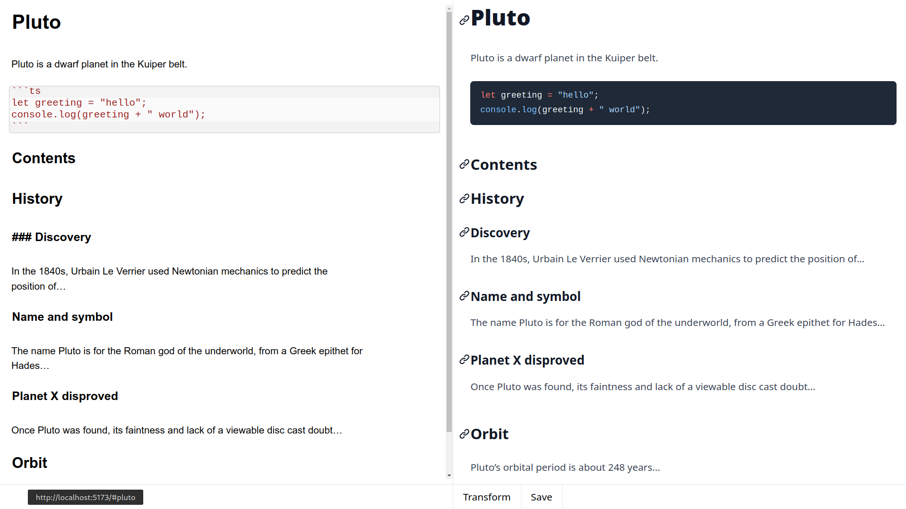

# MD-HTML Editor



[Live Demo](https://md-html-editor.pages.dev)

A markdown to HTML editor with live preview and save functionality.

## Features

- Real-time markdown parsing
- HTML output preview
- Save generated HTML files
- Code syntax highlighting

## Getting Started

1. Install dependencies:

```bash
npm install
```

2. Start the development server:

```bash
npm run dev
```

3. Start editing in the left pane to see live HTML preview
